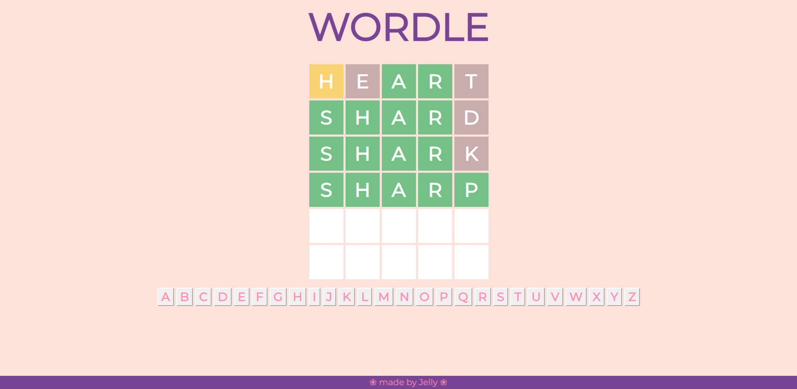

# :a: Jelly Wordle
A clone of the popular web game [Wordle](https://www.nytimes.com/games/wordle/index.html).
This project was first accomplished in September 2022 as part of a Programming Languages course, with the goal of learning
!

## ✨Demo
:ribbon: Try it out → [Jelly Wordle](https://anjellyrika.github.io/jelly-wordle/)

